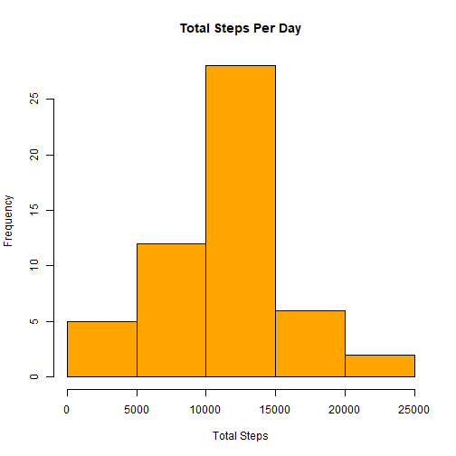
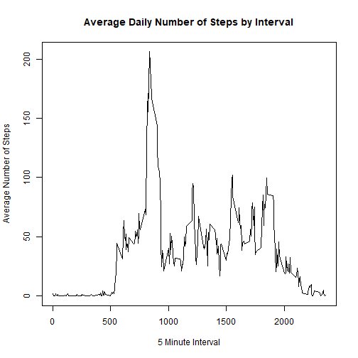
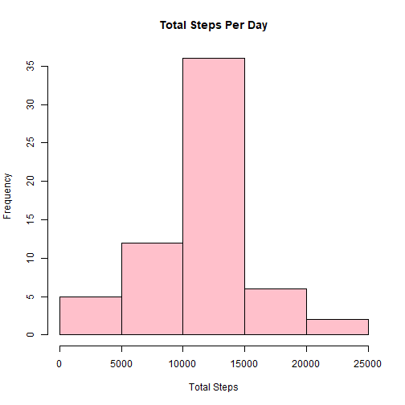
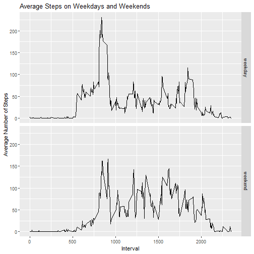

## Loading and Preprocessing the Data

First, unzip and read the data. There are three variables: steps, date, interval. Refer to **README.md** for information on the data set and variables.


```r
data <- read.csv(unzip("activity.zip"))
```

Now let's look at some summary statistics. 


```r
head(data)
```

```
##   steps       date interval
## 1    NA 2012-10-01        0
## 2    NA 2012-10-01        5
## 3    NA 2012-10-01       10
## 4    NA 2012-10-01       15
## 5    NA 2012-10-01       20
## 6    NA 2012-10-01       25
```

```r
str(data)
```

```
## 'data.frame':	17568 obs. of  3 variables:
##  $ steps   : int  NA NA NA NA NA NA NA NA NA NA ...
##  $ date    : Factor w/ 61 levels "2012-10-01","2012-10-02",..: 1 1 1 1 1 1 1 1 1 1 ...
##  $ interval: int  0 5 10 15 20 25 30 35 40 45 ...
```

```r
summary(data)
```

```
##      steps                date          interval     
##  Min.   :  0.00   2012-10-01:  288   Min.   :   0.0  
##  1st Qu.:  0.00   2012-10-02:  288   1st Qu.: 588.8  
##  Median :  0.00   2012-10-03:  288   Median :1177.5  
##  Mean   : 37.38   2012-10-04:  288   Mean   :1177.5  
##  3rd Qu.: 12.00   2012-10-05:  288   3rd Qu.:1766.2  
##  Max.   :806.00   2012-10-06:  288   Max.   :2355.0  
##  NA's   :2304     (Other)   :15840
```

Convert the "date" variable into a Date object.


```r
data$date <- as.Date(data$date)
```

We can now begin analysis.

---

## Total Number of Steps Per Day

**Note:** Missing values will be ignored in this section. 

First, calculate the total steps taken per day.


```r
total_steps <- aggregate(steps ~ date, data = data, sum, na.rm = TRUE)
```

Now, make a histogram showing the total number of steps taken per day.


```r
with(total_steps, hist(steps, xlab = "Total Steps", main = "Total Steps Per Day", col = "orange"))
```



Calculate the mean and median of the total steps per day.


```r
mean_total <- mean(total_steps$steps, na.rm = TRUE)
median_total <- median(total_steps$steps, na.rm = TRUE)
```

The mean is 10766.1886792 and the median is 10765.

---

## Average Daily Activity Pattern

Make a time series plot of the 5-minute interval (x-axis) and the average number of steps taken, averaged across all days (y-axis).


```r
#Calculate avergage steps for each interval.
stepsInt <- aggregate(steps ~ interval, data = data, mean, na.rm = TRUE)

with(stepsInt, plot(interval, steps, type="l", xlab="5 Minute Interval", ylab="Average Number of Steps", main="Average Daily Number of Steps by Interval"))
```



Find the interval that contains the maximum number of steps, averaged across all days.


```r
stepsInt[which.max(stepsInt$steps),]
```

```
##     interval    steps
## 104      835 206.1698
```

---

## Imputing Missing Values

There are quite a few of observations with missing values (NA) for steps. The presence of missing values may introduce bias into some calculations or summaries of the data.

The total number of NAs in the data set are as follows.


```r
sum(is.na(data))
```

```
## [1] 2304
```

So, there are **2304** rows with NAs in the data set.

These NAs will be imputed, or replaced with a substituted value. A new data set will be created by replacing the NAs with the **mean for the corresponding 5 minute interval**.

This new data set will be equal to the original but the NAs will be substituted.


```r
library(dplyr)
```

```
## 
## Attaching package: 'dplyr'
```

```
## The following objects are masked from 'package:stats':
## 
##     filter, lag
```

```
## The following objects are masked from 'package:base':
## 
##     intersect, setdiff, setequal, union
```

```r
data_impute <- data %>%
        group_by(interval) %>%
        mutate(steps = replace(steps, is.na(steps), mean(steps, na.rm = TRUE)))

head(data_impute)
```

```
## # A tibble: 6 x 3
## # Groups:   interval [6]
##    steps date       interval
##    <dbl> <date>        <int>
## 1 1.72   2012-10-01        0
## 2 0.340  2012-10-01        5
## 3 0.132  2012-10-01       10
## 4 0.151  2012-10-01       15
## 5 0.0755 2012-10-01       20
## 6 2.09   2012-10-01       25
```

With the new data set, make a new histogram showing the total number of steps taken per day. Compare this to the first histogram made.


```r
total_steps_imp <- aggregate(steps ~ date, data = data_impute, sum, na.rm = TRUE)

with(total_steps_imp, hist(steps, xlab = "Total Steps", main = "Total Steps Per Day", col = "pink"))
```



Calculate the mean and median of the total steps per day for the new data set.


```r
mean_imp <- mean(total_steps_imp$steps, na.rm = TRUE)
median_imp <- median(total_steps_imp$steps, na.rm = TRUE)
```

The mean is 10766.1886792 and the median is 10766.1886792. 

This new mean is **equal** to the previous mean (10766.1886792). 

The new median is **greater than** the previous meadian (10765).

---

## Comparing Activity Patterns on Weekdays and Weekends

**Note:** The imputed data set will be used.

In order to compare, a new factor variable will be created to indicate whether a "date" variable entry is a *weekday* or *weekend day*

```r
data_impute <- mutate(data_impute, day = weekdays(date))

#Assign day to either "weekend" or "weekday".
data_impute$day <- ifelse(data_impute$day %in% c("Saturday", "Sunday"), "weekend", "weekday") 

data_impute$day <- as.factor(data_impute$day)

table(data_impute$day)
```

```
## 
## weekday weekend 
##   12960    4608
```


```r
#Calculate avergage steps for weekend and weekdays.
stepsInt_days <- aggregate(steps ~ interval + day, data = data_impute, mean)

library(ggplot2)

g <- ggplot(stepsInt_days, aes(x = interval, y = steps))

g + geom_line() + 
        facet_grid(day ~ .) +
        labs(x = "Interval", 
             y = "Average Number of Steps") +
        ggtitle("Average Steps on Weekdays and Weekends")
```


